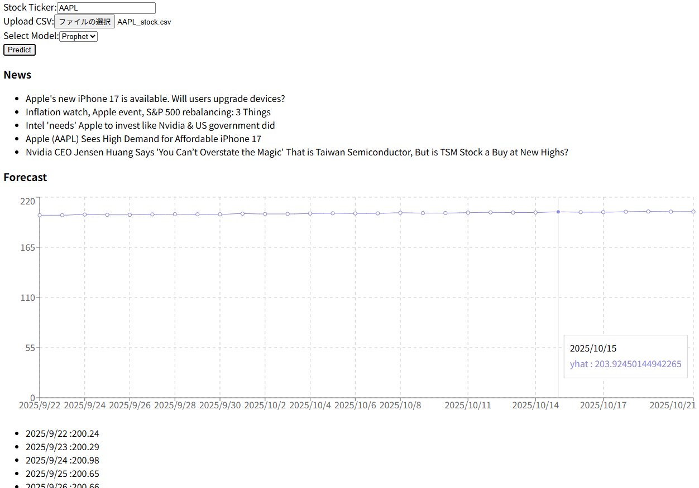

# Stock Forecast App

AI を活用して株価の予測を行う Web アプリケーションです。  
FastAPI（バックエンド）と React（フロントエンド）で構築しています。

---

##  機能
- 過去データをもとにした株価予測
- 銘柄を選択してチャートを表示
- 将来の予測値をグラフで可視化
- シンプルな UI で直感的に利用可能

---

##  動作環境
- Python 3.9+
- Node.js 18+
- npm または yarn
- Git

---

## セットアップ手順

### 1. リポジトリをクローン
```bash
git clone https://github.com/yana0713198-netizen/stock-forecast-app.git
cd stock-forecast-app


### 2. バックエンド（FastAPI）のセットアップ
cd backend
python -m venv venv
source venv/bin/activate   # Windows: venv\Scripts\activate
pip install -r requirements.txt


環境変数を設定（.env ファイルを作成してください）:

API_KEY=your_api_key_here


起動:

uvicorn app:app --reload --port 8000

### 3. フロントエンド（React）のセットアップ
cd ../frontend
npm install
npm start


ブラウザで http://localhost:3000
 を開くとアプリが表示されます。

### 使い方

トップページで銘柄コードを入力します

「予測する」ボタンを押します

過去データのチャートと予測グラフが表示されます

銘柄を切り替えて複数の予測を比較できます

### 技術スタック

フロントエンド: React, TailwindCSS, Recharts

バックエンド: FastAPI, Python

その他: GitHub, npm